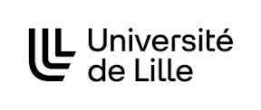

# Practical Work DTW of IHMA

This upload corresponds with the "DTW" Practival Work (PW) of IHMA available [here](https://gery.casiez.net/IHMA/TP_DTW/).
This PW consisted of

* se familiariser avec la technique Dynamic Time Warping
* mettre en oeuvre Dynamic Time Warping pour la reconnaissance de gestes

---
##  Squad's Members

* Nollet Antoine
* himself

---
## Content of this work

* **dist** (distribution of executables `.jar`) (see dtw.jar)
* **lib** (library containing what we need to do the tests and to create the executables)
* **src** (contains the differents codes `.java`)
* **test** (contains `test` programs)
* **media** (contains the `sounds` and `pictures`)
* **makefile** (file making easier this work's using)
* [**readme.md**](readme.md "readme menu") (the readme's menu)
* [**[fr]readme.md**]([fr]readme.md "readme in french") (the file you are reading, in french)
* [**[en]readme.md**]([en]readme.md "readme in english") (the file you are reading, in english)
* [**Q5.md**](Q5.md "Q5 answer") (answer of the 5th question of the PW)

---
## Explanations

If you're reading that, you've been granted to access to my IHMA project.
Use the clone option of this IHMA folder and create a local folder, if it's not already done.

Open a shell from this local folder, the **git pull** command is recommended for each times you come back to this work.

From the root of this work folder, in a shell, you could use this differents commands :

* **make** : run the `executable` of this project
* **make comp** : build the differents `classes`
* **make compTest** : build the `testing classes`
* **make doc** : create the `documentation`
* **make test** : make the differents `tests`
* **make extract** : extract the classes from the `.jar` files
* **make exe** : create the `executables`
* **make dtw** : run the `executable` of this project
* **make clean** : delete all the `.class` files, the `docs` folder and the extracted files created with `make extract`

---

If you have questions about this project, don't hesitate to contact me from this email : **antoine.nollet.etu@univ-lille.fr**

Thanks for your reading !
---
 
 
 

